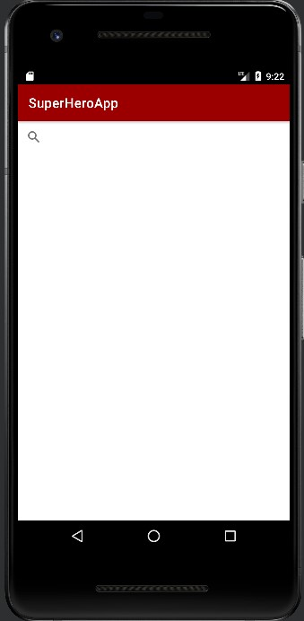
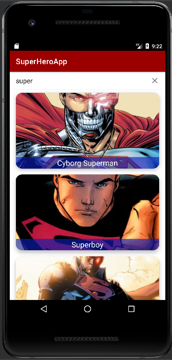
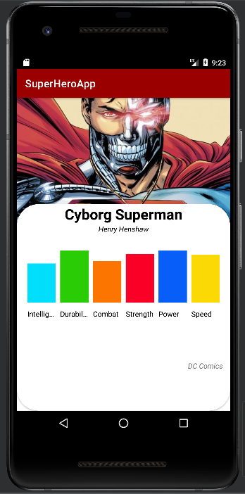

# Search Superhero APP 👋

## My Android project is an application that allows you to search for superheroes through an API and display their details.


## characteristics

- Use of RecyclerView
- API consumption with Retrofit
- Layout with XML


## Installation:

```
Dependencies{
//Retrofit
implementation "com.squareup.retrofit2:retrofit:2.9.0"
implementation "com.squareup.retrofit2:converter-gson:2.9.0"
//piccaso
implementation 'com.squareup.picasso:picasso:2.8' 
}
```


## Layout 



